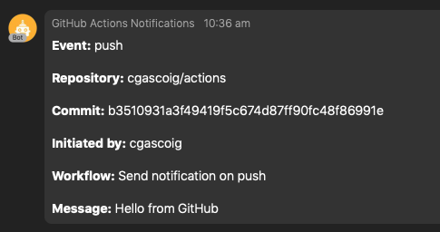

# WebEx Teams
GitHub Action for sending WebEx Teams messages

## Secrets
* `WEBEX_TEAMS_ACCESS_TOKEN` - *Required* the access token to use with WebEx Teams API. (Most likely you will want to create a new bot as described [here](https://developer.webex.com/docs/bots) and use it's access token)

## Environment variables

*None*

## Arguments

* `--room` Name of the WebEx Teams room to send messages to. If you want messages to go directly to yourself this is your own name. (Note: the room has to already exist and the bot should be added to it, therefore, for a direct message, you need to send a message to the bot first)
* `--message` Custom message to include

## Example
```hcl
workflow "Send notification on push" {
  on = "push"
  resolves = ["WebEx Teams Notification"]
}

action "WebEx Teams Notification" {
  uses = "cgascoig/actions/webexteams"
  secrets = ["WEBEX_TEAMS_ACCESS_TOKEN"]
  args = "--room Chris Gascoigne --message Hello from GitHub"
}
```

## Screenshot
Example notification:


